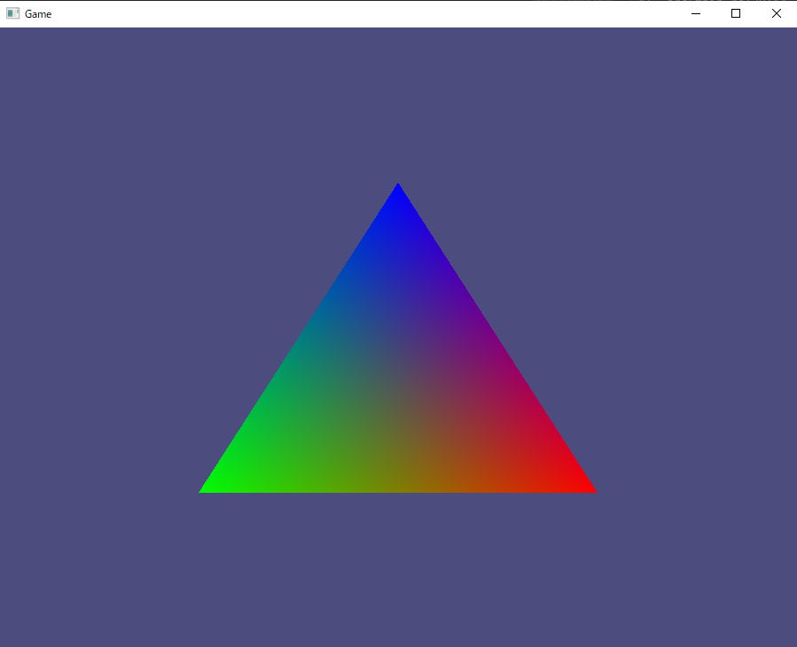

# rust-opengl-scratch

## やりたいこと
- Rust + OpenGLで最低限動く環境を作って確認する

## チュートリアル
- [Rust and OpenGL from scratch - Setup](http://nercury.github.io/rust/opengl/tutorial/2018/02/08/opengl-in-rust-from-scratch-00-setup.html)
  - ↑に従って↓のような三角形を描画するRustアプリを作る



## 経緯
- 当初はdevcontainer環境で実行するつもりだった
- が、WSL2から起動したdockerコンテナ上で動かすので色々課題があった
- コンテナで動くxeyesアプリをwindows上に描画することはできているが、opengl周りはちょっと難しかった
- ひとまずRustの言語仕様に触れることとグラフィックの描画ができることを最優先とするため、確実に動くであろう環境で確認することにした
- WSL2でもXServer周りの問題が出るのはdockerコンテナと同じと思われるため、純粋なwindows環境を使うことにした

## 環境
### Rustのインストール＠windows
- [Getting started](https://www.rust-lang.org/learn/get-started)
- rustup-init.exe(64bit)を実行
- `C:\Users\{username}\.cargo\bin`へのPATHが通り、cargo.exeなどが使えるようになった

### 足りないパッケージの入手
- cmakeが足りなかったので追加

```
scoop install cmake
```

## ビルドと実行
- powershellから実行する

```
cargo.exe build
```

```
cargo.exe run
```